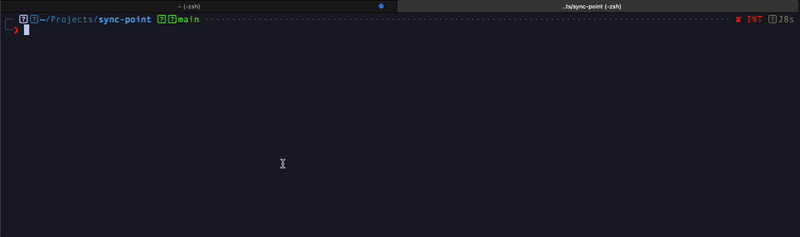

# sync-point
A small web service with a single endpoint to allows two parties to sync

### Endpoint
`/wait-for-second-party/:unique-id`
- Method: `POST`
- Functionality: The first party to make a request is blocked until the second party makes a request with the same `unique-id` or the timeout period elapses.

### Configuration
```sh
RUST_LOG=debug

SYNC_POINT_TIMEOUT_SEC=10
SYNC_POINT_ADDR=127.0.0.1:8000
```

### Usage


### Running
```sh
cp .env.example .env
cargo r --release
```

